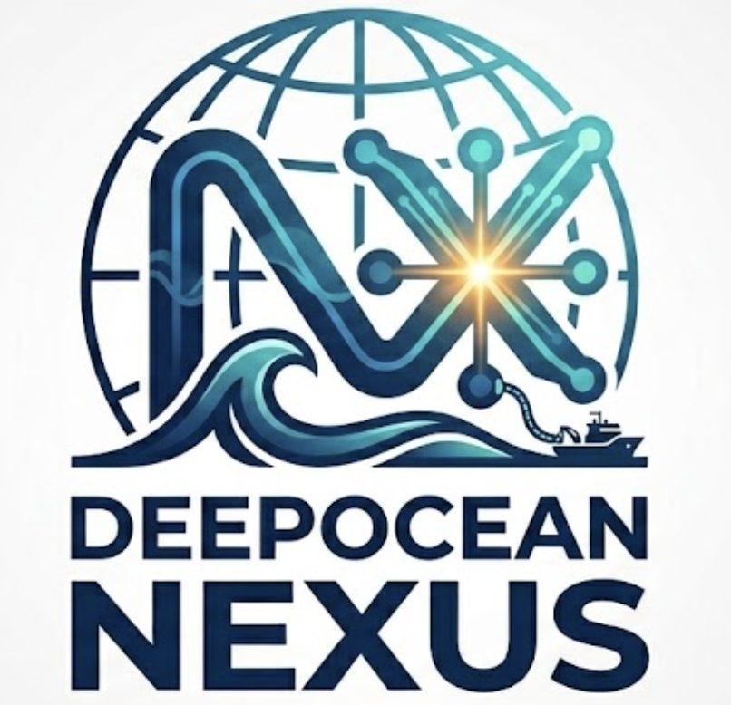

# DeepOcean Nexus



## Global Subsea Communications Infrastructure Platform

DeepOcean Nexus is a full DevOps project built to simulate a mission-critical subsea cable monitoring ecosystem. The repository demonstrates:

- Automated infrastructure provisioning using Terraform
- Containerized Python Flask application with Docker
- Kubernetes deployment with replication, health probes, and namespace isolation
- Jenkins CI/CD pipeline for build, push, and deploy automation
- Prometheus and Grafana observability for real-time metrics
- Disaster recovery planning, logging strategy, and security-aware deployment pattern

---

## 🚀 Project Overview

This project is inspired by Case Study 134: Project DeepOcean Nexus and models a cloud-native operations platform for undersea fiber-optic cable monitoring. It integrates real submarine cable metadata, simulated network operations center (NOC) telemetry, and modern DevOps practices to improve resilience, observability, and deployment automation.

## 🔧 Key Features

- Real-time dashboard served by a Python Flask app
- Live submarine cable map using ArcGIS TeleGeography data
- Simulated NOC telemetry, alerts, and cable health indicators
- Prometheus metrics exposed at `/metrics` and scraped by Prometheus
- Grafana dashboards for visual observability
- Kubernetes deployment with 3 replicas and self-healing probes
- Jenkins pipeline to build Docker image, push to Docker Hub, and deploy to Kubernetes
- Terraform-managed `deepocean` namespace for cluster isolation
- Disaster recovery and backup procedures documented in repository

---

## 📁 Repository Structure

- `app/` — Python Flask application, frontend templates, static assets, and runtime requirements
- `kubernetes/` — Kubernetes deployment, service, and secret manifests for the app
- `terraform/` — Terraform configuration provisioning the `deepocean` namespace
- `jenkins/` — Jenkins pipeline definition for CI/CD automation
- `monitoring/` — Prometheus and Grafana Docker Compose stack
- `logging/` — Logging configuration examples for Fluent Bit
- `backup/` — Kubernetes backup manifests and snapshots
- `architecture.md` — Architecture document and component flow diagram
- `project_report.md` — Detailed project report, analysis, and implementation summary
- `disaster_recovery.md` — Disaster recovery plan and recovery procedures
- `logging.md` — Logging strategy and future ELK discussion
- `viva_questions.md` — Viva voce preparation questions and answers
- `DeepOcean_Nexus Images Screenshot Proof.md` — Proof gallery and visual evidence of the project

---

## 🧠 Architecture Diagram

```text
[Developer]
     │ (git push)
     ▼
[GitHub Repository]
     │
     ▼ (webhook / polling)
[Jenkins Build Server] ─── (runs stages)
     │
     ├───► [Docker Agent] ─── (compiles image) ───► [Docker Hub]
     │                                                     │
     └───► [Kubectl Deployer] ─────────────────────────────┼────────┐
                                                           │        │
                                                           ▼        ▼
                                                 [Kubernetes Cluster (Pods)]
                                                           │        │
                                                   (pulls) │        │ (exposes)
                                                           ▼        ▼
                                                      [Prometheus]  [Web UI]
                                                           │
                                                           ▼
                                                       [Grafana]
```

---

## 🛠️ Technology Stack

- Python 3.11+ / Flask
- Docker
- Kubernetes
- Terraform
- Jenkins
- Prometheus
- Grafana
- Fluent Bit / Logging
- ArcGIS TeleGeography API (map metadata)
- Git

---

## ▶️ Run Locally

### 1. Prerequisites

Install and configure:

- Docker Desktop
- Kubernetes CLI (`kubectl`)
- Terraform
- A local Kubernetes context (Minikube, Docker Desktop Kubernetes, etc.)
- Jenkins (optional for CI/CD automation)

### 2. Build and Run the App

```bash
cd app
docker build -t deepocean-app:latest .
docker run -d \
  -p 5000:5000 \
  -p 8000:8000 \
  --name deepocean-local \
  deepocean-app:latest
```

Open:

- App dashboard: `http://localhost:5000`
- App metrics: `http://localhost:8000/metrics`

### 3. Provision Kubernetes Namespace

```bash
cd terraform
terraform init
terraform apply -auto-approve
```

### 4. Deploy to Kubernetes

```bash
cd ../kubernetes
kubectl apply -f .
```

### 5. Start Observability Stack

```bash
cd ../monitoring
docker-compose up -d
```

Open:

- Prometheus: `http://localhost:9090`
- Grafana: `http://localhost:3000`

---

## 📡 Prometheus Configuration

Prometheus scrapes the application metrics endpoint every 5 seconds.

```yaml
global:
  scrape_interval: 5s

scrape_configs:
  - job_name: "deepocean"
    static_configs:
      - targets:
          - host.docker.internal:8000
```

---

## 📦 CI/CD with Jenkins

The `jenkins/Jenkinsfile` pipeline includes:

1. Build Docker image from `app/`
2. Authenticate with Docker Hub
3. Push image to `rayan221006/deepocean-app:latest`
4. Deploy Kubernetes manifests from `kubernetes/`

This enables automated delivery from source control to cluster deployment.

---

## 🧪 Validation and Recovery

### Health check

The app exposes a liveness/readiness endpoint:

- `http://<pod-ip>:5000/health`

Kubernetes probes are configured to auto-restart unhealthy containers.

### Simulate failure

```bash
kubectl delete pod -n deepocean <pod-name>
```

Kubernetes will recreate the pod and maintain availability.

### Disaster recovery

See `disaster_recovery.md` for strategy details, including:

- namespace reprovisioning
- container image recovery
- infrastructure redeployment
- backup and secret restoration

---

## 📘 Logging & Observability

Current logging captures stdout from the Flask app and is available through Kubernetes pod logs:

```bash
kubectl logs deployment/deepocean-app -c app -n deepocean -f
```

Future production enhancements are documented in `logging.md`, including ELK stack integration and centralized log collection.

---

## 🖼️ Visual Proof and Assets

This repo includes a proof gallery and screenshot evidence in `DeepOcean_Nexus Images Screenshot Proof.md`.


---

## 📌 Notes

- The application uses `fake_telemetry.py` to generate NOC telemetry for dashboard simulation.
- Real cable metadata is fetched from ArcGIS using `arcgis_client.py`.
- The project emphasizes a secure, automated deployment pipeline supported by Kubernetes and monitoring.

## 📂 Important Files

- `app/app.py`
- `app/templates/index.html`
- `kubernetes/deployment.yaml`
- `kubernetes/service.yaml`
- `terraform/main.tf`
- `jenkins/Jenkinsfile`
- `monitoring/docker-compose.yml`
- `monitoring/prometheus.yml`
- `architecture.md`
- `project_report.md`
- `disaster_recovery.md`
- `logging.md`
- `viva_questions.md`

---

## 💬 Contact

For more details, inspect the project documentation and code files in this repository.

