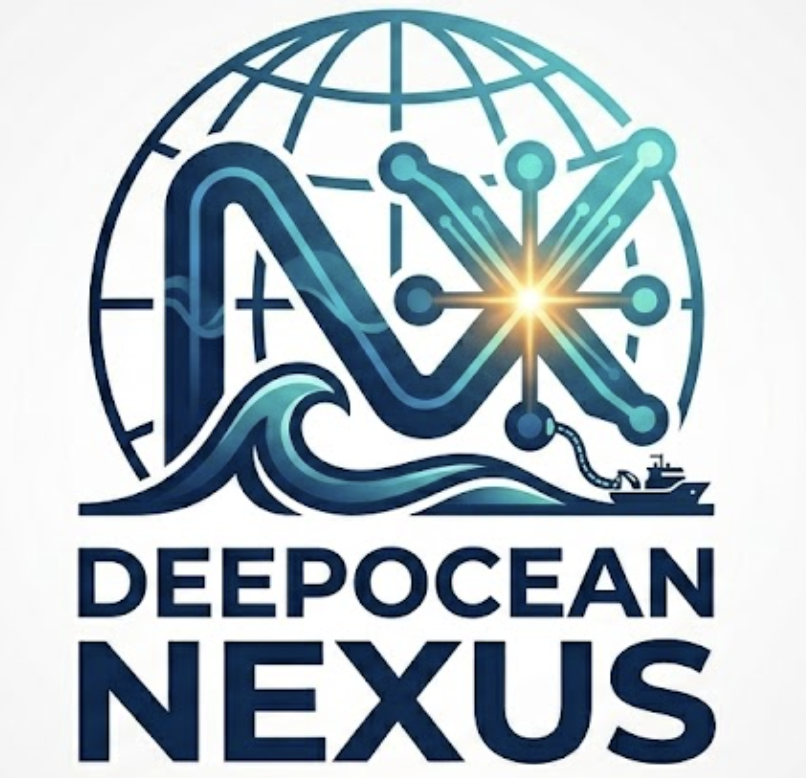

<div align="center">



### Global Network Operations Center — Subsea Communications Infrastructure Platform

[](https://python.org)
[](https://flask.palletsprojects.com)
[](https://docker.com)
[](https://kubernetes.io)
[](https://jenkins.io)
[](https://terraform.io)
[](https://prometheus.io)
[](https://grafana.com)
[](LICENSE)

---

**Author:** Rayan MZ &nbsp;·&nbsp; **Roll No:** `150096724141` &nbsp;·&nbsp; **Docker Hub:** [`rayan221006`](https://hub.docker.com/r/rayan221006/deepocean-app)

🔴 **Live Dashboard:** [deepocean-nexus on Render](https://deepocean-nexus.onrender.com) &nbsp;·&nbsp; 🐳 **Image:** `rayan221006/deepocean-app:latest`

</div>

---

## 📖 Table of Contents

- [Project Overview](#-project-overview)
- [Live Demo](#-live-demo)
- [Features](#-key-features)
- [Tech Stack](#%EF%B8%8F-technology-stack)
- [Architecture](#-system-architecture)
- [How It Works](#-how-it-works)
- [Data Flow](#-data-flow)
- [Repository Structure](#-repository-structure)
- [API Reference](#-api-reference)
- [Running Locally](#%EF%B8%8F-running-locally)
- [Docker Setup](#-docker-setup)
- [Kubernetes Deployment](#-kubernetes-deployment)
- [CI/CD Pipeline](#-cicd-pipeline--jenkins)
- [Infrastructure as Code](#-infrastructure-as-code--terraform)
- [Observability](#-observability--prometheus--grafana)
- [Logging](#-logging)
- [Disaster Recovery](#-disaster-recovery)
- [Dashboard Preview](#-dashboard-preview)
- [Project Context](#-project-context)

---

## 🌐 Project Overview

**DeepOcean Nexus** is a **full-stack cloud-native DevOps project** that simulates a mission-critical **Global Network Operations Center (NOC)** for monitoring subsea fiber-optic telecommunication cables around the world.

This project addresses the challenges described in **Case Study 134 — Project DeepOcean Nexus**, where legacy infrastructure suffered from:

- ❌ Manual deployments causing downtime and human error
- ❌ Fragmented diagnostics slowing incident response
- ❌ No automated failover, delaying service recovery
- ❌ Zero centralized observability

The solution delivers a **modern cloud-native platform** combining:

> **Real Cable Data** from TeleGeography/ArcGIS + **Simulated NOC Telemetry** + **Full DevOps Automation Stack**

---

## 🔴 Live Demo

| Resource | URL |
|---|---|
| 🌐 **Live Dashboard** | [https://deepocean-nexus.onrender.com](https://deepocean-nexus.onrender.com) |
| 🐳 **Docker Hub Image** | [`rayan221006/deepocean-app:latest`](https://hub.docker.com/r/rayan221006/deepocean-app) |
| 💻 **GitHub Repository** | [github.com/rayanrawat/DeepOcean-Nexus](https://github.com/rayanrawat/DeepOcean-Nexus) |

---

## ✨ Key Features

### 🗺️ Real-Time Global Cable Map
- **400+ real submarine cables** rendered on an interactive Leaflet.js world map
- Data sourced live from **TeleGeography's SubmarineCableMap API** (GeoJSON)
- Fallback to **ArcGIS FeatureServer** if primary source is unavailable
- Anti-meridian fix for trans-Pacific cables crossing the International Date Line
- Click any cable to inspect metadata: length, owners, RFS year, route

### 📡 Live NOC Telemetry Dashboard
- Executive Summary with 6 real-time KPI cards: Active Cables, Active Sensors, Active Alerts, Security Score, Total Throughput (Tbps), Ocean Status
- **30-cable fleet** with realistic cable names (Tata, Reliance Jio, BSNL, Google, Microsoft, Meta)
- Auto-refreshing every 3 seconds via polling API
- Dark mode / Light mode toggle

### 🏥 Network Operations Center (NOC) Panels
- Physical Environment monitoring: water temperature, pressure, depth, wave height, current speed
- Network metrics: latency, packet loss, bandwidth utilization, jitter, throughput (Tbps)
- Security Center: threat levels, DDoS risk, intrusion alerts, security score
- DevOps Infrastructure health: Docker, Jenkins, Kubernetes pod status

### 🛡️ DevOps Automation
- **Dockerized** Python Flask app with multi-port exposure (5000 + 8000)
- **Kubernetes** 3-replica HA deployment with liveness/readiness probes
- **Jenkins CI/CD** pipeline: Build → Push to Docker Hub → Deploy to K8s
- **Terraform** IaC for namespace provisioning
- **Prometheus + Grafana** observability stack
- **Fluent Bit** log aggregation

---

## 🛠️ Technology Stack

| Layer | Technology | Purpose |
|---|---|---|
| **Backend** | Python 3.11+ / Flask | REST API, dashboard serving |
| **Frontend** | HTML5, CSS3, Vanilla JS | Real-time dashboard UI |
| **Map** | Leaflet.js | Interactive submarine cable visualization |
| **Data — Real** | TeleGeography GeoJSON API | 400+ real cable routes & stations |
| **Data — Real (Fallback)** | ArcGIS FeatureServer REST API | Cable metadata backup source |
| **Data — Simulated** | `fake_telemetry.py` | NOC metrics (throughput, threats, sensors) |
| **Containerization** | Docker (python:3.11-slim) | App isolation and portability |
| **Orchestration** | Kubernetes | 3-replica HA deployment + auto-healing |
| **CI/CD** | Jenkins | Build, push, deploy pipeline |
| **IaC** | Terraform (K8s Provider) | Namespace provisioning |
| **Metrics** | Prometheus Client | Gauges: cables, throughput, latency, loss |
| **Visualization** | Grafana | Live metric dashboards |
| **Logging** | Fluent Bit | Log shipping to aggregation backend |
| **Production Deploy** | Render (render.yaml + Gunicorn) | Cloud hosting |
| **Registry** | Docker Hub | Container image storage |
| **Version Control** | Git / GitHub | Source control |

---

## 🏗️ System Architecture

```
╔══════════════════════════════════════════════════════════════════════╗
║                    DEEPOCEAN NEXUS — ARCHITECTURE                    ║
╚══════════════════════════════════════════════════════════════════════╝

  [Developer Workstation]
         │
         │  git push
         ▼
  ┌─────────────────────┐
  │   GitHub Repository  │  ← Source of truth for code + K8s manifests
  └─────────┬───────────┘
            │
            │  webhook / polling
            ▼
  ┌─────────────────────────────────────────────────────────┐
  │                  Jenkins Build Server                    │
  │                                                         │
  │  Stage 1: Build Docker          Stage 2: Push Image     │
  │  ┌─────────────────────┐    ┌──────────────────────┐   │
  │  │ docker build -t     │───►│ docker push          │   │
  │  │ rayan221006/deepo.. │    │ rayan221006/deepo..   │   │
  │  └─────────────────────┘    └──────────┬───────────┘   │
  │                                        │                │
  │  Stage 3: Deploy to Kubernetes         │                │
  │  ┌─────────────────────┐               │                │
  │  │ kubectl apply -f    │               │                │
  │  │ kubernetes/         │               │                │
  │  └─────────┬───────────┘               │                │
  └────────────┼──────────────────────────┼────────────────┘
               │                          │
               │ deploys                  │ pulls image
               ▼                          ▼
  ┌─────────────────────┐        ┌──────────────────────┐
  │  Kubernetes Cluster  │        │      Docker Hub       │
  │  namespace: deepocean│◄───────│ rayan221006/deepo..   │
  │                      │        └──────────────────────┘
  │  ┌────────────────┐  │
  │  │   Pod 1 (app)  │  │  Port 5000 → Flask Dashboard
  │  │   Pod 2 (app)  │  │  Port 8000 → Prometheus Metrics
  │  │   Pod 3 (app)  │  │
  │  └───────┬────────┘  │
  │          │            │
  │  ┌───────▼────────┐  │
  │  │  K8s Service   │  │  NodePort: 30000
  │  │  (NodePort)    │  │
  │  └───────┬────────┘  │
  └──────────┼────────────┘
             │
     ┌───────┴────────────────────────┐
     │                                │
     ▼                                ▼
┌─────────────────┐           ┌──────────────────┐
│   Web Browser   │           │   Prometheus      │
│  (Dashboard)    │           │   (port 9090)     │
│  live telemetry │           │   scrapes :8000   │
└─────────────────┘           └────────┬─────────┘
                                       │
                                       ▼
                              ┌──────────────────┐
                              │     Grafana       │
                              │   (port 3000)     │
                              │  visual charts    │
                              └──────────────────┘

  Logging Layer:
  ┌──────────────────────────────────────┐
  │  Fluent Bit  →  Log Aggregation      │
  │  kubectl logs → Real-time stdout     │
  └──────────────────────────────────────┘

  IaC Layer:
  ┌──────────────────────────────────────┐
  │  Terraform  →  K8s Namespace Setup   │
  │  (deepocean namespace provisioning)  │
  └──────────────────────────────────────┘
```

---

## ⚙️ How It Works

### 1. Data Ingestion Layer

```
TeleGeography GeoJSON API  ──────────────────────────────────┐
(www.submarinecablemap.com)                                   │
                                                             ▼
ArcGIS FeatureServer (Fallback)  ──────►  arcgis_client.py  ──►  /api/map-data
                                         (1-hour in-memory cache)

fake_telemetry.py  ──────────────────────────────────────────►  /api/noc-status
(generates realistic NOC telemetry every call)               ──►  /api/dashboard-summary
```

### 2. Application Layer (Flask)

| Endpoint | Data Source | Description |
|---|---|---|
| `GET /` | Template | Main dashboard HTML |
| `GET /api/map-data` | **REAL** — TeleGeography | Cable routes + landing stations |
| `GET /api/noc-status` | **FAKE** — Simulated | Full NOC telemetry payload |
| `GET /api/dashboard-summary` | **FAKE** — Simulated | Lightweight KPI summary for polling |
| `GET /api/cable-details?id=&name=` | **REAL** — ArcGIS | Specific cable metadata on click |
| `GET /health` | Internal | Kubernetes liveness/readiness probe |
| `GET /version` | Internal | App version info |
| `GET /metrics` | Prometheus Client | Gauges for scraping |

### 3. Frontend Layer (Vanilla JS + Leaflet.js)

```
Page Load
    │
    ├── fetchMapData() ───► /api/map-data ───► Render cables on Leaflet map
    │                                          (polylines + landing point markers)
    │
    └── pollDashboard() every 3s ───► /api/dashboard-summary ───► Update KPI cards
                                   ───► /api/noc-status       ───► Update NOC panels
```

### 4. Prometheus Metrics (Port 8000)

```python
deepocean_requests_total       # Counter: total dashboard requests
deepocean_active_cables        # Gauge: number of active cables
deepocean_throughput_tbps      # Gauge: global throughput (Tbps)
deepocean_latency_ms           # Gauge: average latency (ms)
deepocean_packet_loss_pct      # Gauge: packet loss (%)
deepocean_security_score       # Gauge: security score (%)
```

---

## 🔄 Data Flow

```
User Browser
     │
     │ HTTP GET /
     ▼
Flask (app.py)  ──────────────────────────────────────────────────────┐
     │                                                                │
     │  Serves index.html                                             │
     ▼                                                                │
Browser renders map + polls APIs every 3 seconds                     │
     │                                                                │
     ├── GET /api/map-data ─────────────────────────────────────────► │
     │        │                                                       │
     │        ▼                                                       │
     │   arcgis_client.fetch_map_data()                               │
     │        │                                                       │
     │        ├── Try: TeleGeography GeoJSON API                      │
     │        │         (cables: /api/v3/cable/cable-geo.json)        │
     │        │         (stations: /api/v3/landing-point/...)         │
     │        │                                                       │
     │        ├── Antimeridian fix (_normalize_path)                  │
     │        │                                                       │
     │        └── Fallback: ArcGIS FeatureServer                      │
     │                                                                │
     │   Response: {cables: [...], stations: [...]}  ◄─────────────── │
     │        │                                                       │
     │        ▼                                                       │
     │   Leaflet.js draws polylines + circle markers                  │
     │                                                                │
     └── GET /api/dashboard-summary ───────────────────────────────► │
              │                                                       │
              ▼                                                       │
         fake_telemetry.generate_noc_data()                           │
              │                                                       │
              ├── Picks cable fleet names (30 real cables)            │
              ├── Randomizes statuses: HEALTHY / DEGRADED / CRITICAL  │
              ├── Generates sensor readings, alert types              │
              ├── Updates Prometheus Gauges                           │
              └── Returns JSON snapshot                               │
                                                                      │
         Response: {active_cables, throughput_tbps, ...}  ◄────────── │
              │
              ▼
         Dashboard KPI cards update in real-time
```

---

## 📁 Repository Structure

```
DeepOcean_Nexus_DevOps_Project/
│
├── 📱 app/                          # Flask Application
│   ├── app.py                       # Main Flask server + API routes
│   ├── arcgis_client.py             # Real cable data from TeleGeography / ArcGIS
│   ├── fake_telemetry.py            # Simulated NOC telemetry generator
│   ├── requirements.txt             # Python dependencies (Flask, prometheus-client)
│   ├── Dockerfile                   # Container definition (python:3.11-slim)
│   ├── templates/
│   │   └── index.html               # Full dashboard (4,000+ lines, dark/light mode)
│   └── static/                      # Static assets
│
├── ☸️  kubernetes/                   # Kubernetes Manifests
│   ├── deployment.yaml              # 3-replica deployment with health probes
│   ├── service.yaml                 # NodePort service (port 30000)
│   └── secret.yaml                  # Base64-encoded API secrets
│
├── 🏗️  terraform/                    # Infrastructure as Code
│   └── main.tf                      # K8s namespace provisioning (deepocean)
│
├── 🔁 jenkins/                       # CI/CD
│   └── Jenkinsfile                  # Build → Push → Deploy pipeline
│
├── 📊 monitoring/                    # Observability Stack
│   ├── docker-compose.yml           # Prometheus + Grafana stack
│   ├── prometheus.yml               # Scrape config (interval: 5s, port 8000)
│   └── monitoring-stack/            # Extended monitoring resources
│
├── 📝 logging/                       # Log Management
│   └── fluent-bit.yaml              # Fluent Bit log collector config
│
├── 💾 backup/                        # Backup Resources
│   └── (K8s backup manifests)
│
├── 🖼️  Logo_White.png                # Project logo (light bg)
├── 🖼️  Logo_Black.png                # Project logo (dark bg)
├── 🔴 Red_Alert.gif                 # Critical alert animation
├── 🟡 Yellow_Alert.gif              # Degraded alert animation
├── 💚 Live_Alert.gif                # Live indicator animation
├── 🔍 Search_Cable.png              # Cable search UI screenshot
│
├── render.yaml                      # Render.com deployment config
├── requirements.txt                 # Full Python dependency list
├── architecture.md                  # Architecture documentation
├── disaster_recovery.md             # DR plan and recovery procedures
├── logging.md                       # Logging strategy
├── project_report.md                # Full project report
├── project_tracker.txt              # Command reference and file tracker
└── README.md                        # This file
```

---

## 🌐 API Reference

### `GET /api/map-data`
Returns **real** submarine cable routes and landing station coordinates.

**Response:**
```json
{
  "cables": [
    {
      "name": "SEA-ME-WE 5",
      "color": "#ff6b35",
      "coords": [[lat, lng], [lat, lng], ...]
    }
  ],
  "stations": [
    {
      "name": "Mumbai Cable Station",
      "lat": 18.9402,
      "lng": 72.8354,
      "cables": ["SEA-ME-WE 5", "IMEWE"]
    }
  ]
}
```

### `GET /api/dashboard-summary`
Returns lightweight **simulated** KPI snapshot (polled every 3 seconds).

**Response:**
```json
{
  "active_cables": 730,
  "active_sensors": 24551,
  "active_alerts": 12,
  "security_score": 98.6,
  "throughput_tbps": 18.2,
  "ocean_status": "Normal",
  "healthy_cables": 685,
  "degraded_cables": 32,
  "critical_cables": 13,
  "noc": { ... },
  "alerts": [...]
}
```

### `GET /api/cable-details?name=SEA-ME-WE+5`
Returns **real** cable metadata on user click.

### `GET /health`
```json
{"status": "healthy", "service": "DeepOcean Nexus"}
```

### `GET /metrics`
Prometheus text-format metrics (scraped on port 8000).

---

## ▶️ Running Locally

### Prerequisites

```bash
# Required
- Python 3.11+
- Docker Desktop
- kubectl
- Terraform
- Minikube or Docker Desktop Kubernetes

# Optional (for CI/CD)
- Jenkins
```

### Quick Start (Python Only)

```bash
git clone https://github.com/rayanrawat/DeepOcean-Nexus.git
cd DeepOcean_Nexus_DevOps_Project

pip install flask prometheus-client requests
cd app && python3 app.py
```

Open: [http://localhost:5000](http://localhost:5000)

---

## 🐳 Docker Setup

### Build and Run

```bash
cd app
docker build -t deepocean-app:latest .

docker run -d \
  -p 5000:5000 \
  -p 8000:8000 \
  --name deepocean-local \
  deepocean-app:latest
```

| Service | URL |
|---|---|
| Dashboard | [http://localhost:5000](http://localhost:5000) |
| Prometheus Metrics | [http://localhost:8000/metrics](http://localhost:8000/metrics) |
| Health Check | [http://localhost:5000/health](http://localhost:5000/health) |

### Use Pre-built Image from Docker Hub

```bash
docker pull rayan221006/deepocean-app:latest
docker run -d -p 5000:5000 -p 8000:8000 rayan221006/deepocean-app:latest
```

### Dockerfile

```dockerfile
FROM python:3.11-slim
WORKDIR /app
COPY requirements.txt .
RUN pip install --no-cache-dir -r requirements.txt
COPY . .
EXPOSE 5000
EXPOSE 8000
CMD ["python", "app.py"]
```

---

## ☸️ Kubernetes Deployment

### 1. Start Cluster

```bash
minikube start --driver=docker
```

### 2. Provision Namespace via Terraform

```bash
cd terraform
terraform init
terraform apply -auto-approve
# Creates: namespace "deepocean"
```

### 3. Apply Kubernetes Manifests

```bash
cd ../kubernetes
kubectl apply -f .
```

This creates:
- **Deployment**: 3 replicas of `rayan221006/deepocean-app:latest`
- **Service**: NodePort exposing port 5000 on NodePort 30000
- **Secret**: Base64-encoded API key

### 4. Verify Deployment

```bash
kubectl get pods -n deepocean
kubectl get svc -n deepocean
kubectl describe deployment deepocean-app -n deepocean
```

### 5. Access the App

```bash
minikube service deepocean-service -n deepocean
# Or: http://<node-ip>:30000
```

### Health Probes (Auto-Healing)

```yaml
livenessProbe:
  httpGet:
    path: /health
    port: 5000
  initialDelaySeconds: 10
  periodSeconds: 5

readinessProbe:
  httpGet:
    path: /health
    port: 5000
  initialDelaySeconds: 10
  periodSeconds: 5
```

### Simulate Pod Failure (Self-Healing Demo)

```bash
# Delete a pod — Kubernetes will recreate it instantly
kubectl delete pod <pod-name> -n deepocean

# Watch recovery in real-time
kubectl get pods -n deepocean -w
```

### Resource Limits

```yaml
resources:
  requests:
    memory: "128Mi"
    cpu: "100m"
  limits:
    memory: "256Mi"
    cpu: "200m"
```

---

## 🔁 CI/CD Pipeline — Jenkins

The Jenkins pipeline fully automates delivery from source to cluster:

```groovy
pipeline {
    agent any
    stages {
        stage('Build Docker') {
            steps {
                sh 'docker build -t rayan221006/deepocean-app:latest app/'
            }
        }
        stage('Push to Docker Hub') {
            steps {
                withCredentials([usernamePassword(credentialsId: 'dockerhub-cred', ...)]) {
                    sh 'docker push rayan221006/deepocean-app:latest'
                }
            }
        }
        stage('Deploy to Kubernetes') {
            steps {
                sh 'kubectl apply -f kubernetes/'
            }
        }
    }
}
```

### Pipeline Flow

```
Code Push  →  Jenkins Triggered  →  Docker Build  →  Docker Hub Push  →  kubectl apply  →  Pods Updated
```

### Running Jenkins Locally

```bash
docker run -d \
  -p 8080:8080 \
  -p 50000:50000 \
  -v jenkins_home:/var/jenkins_home \
  --name jenkins \
  jenkins/jenkins:lts

# Get setup password
docker logs jenkins
```

---

## 🏗️ Infrastructure as Code — Terraform

Terraform provisions the Kubernetes namespace before the app is deployed:

```hcl
# terraform/main.tf
provider "kubernetes" {
  config_path = "~/.kube/config"
}

resource "kubernetes_namespace" "deepocean" {
  metadata {
    name = "deepocean"
  }
}
```

```bash
cd terraform
terraform init
terraform plan
terraform apply -auto-approve
```

---

## 📊 Observability — Prometheus + Grafana

### Start the Monitoring Stack

```bash
cd monitoring
docker-compose up -d
```

| Service | URL |
|---|---|
| Prometheus | [http://localhost:9090](http://localhost:9090) |
| Grafana | [http://localhost:3000](http://localhost:3000) |

### Prometheus Config

```yaml
# monitoring/prometheus.yml
global:
  scrape_interval: 5s

scrape_configs:
  - job_name: "deepocean"
    static_configs:
      - targets:
          - host.docker.internal:8000
```

### Tracked Metrics

| Metric | Type | Description |
|---|---|---|
| `deepocean_requests_total` | Counter | Total dashboard HTTP requests |
| `deepocean_active_cables` | Gauge | Number of active cables monitored |
| `deepocean_throughput_tbps` | Gauge | Current global throughput (Tbps) |
| `deepocean_latency_ms` | Gauge | Average end-to-end latency (ms) |
| `deepocean_packet_loss_pct` | Gauge | Global packet loss (%) |
| `deepocean_security_score` | Gauge | Security score (0–100%) |

### View Live Metrics

```bash
# Directly from the app
curl http://localhost:8000/metrics
```

---

## 📝 Logging

### View Live Pod Logs

```bash
kubectl logs deployment/deepocean-app -c app -n deepocean -f
```

### Fluent Bit Log Collector

Configured in `logging/fluent-bit.yaml` to forward container stdout logs to a centralized logging backend.

Future roadmap: ELK stack integration (Elasticsearch + Logstash + Kibana).

---

## 🆘 Disaster Recovery

### Backup Strategy

| Component | Backup Target | RPO | Method |
|---|---|---|---|
| Source Code | GitHub | Immediate | Git push on commit |
| Container Images | Docker Hub | Per Release | Jenkins pipeline push |
| Infrastructure Config | Terraform HCL | Version-controlled | `terraform.tfstate` |
| Secrets & Keys | Kubernetes Secrets | Per Deployment | Exported YAML backup |

### Recovery Scenarios

#### Scenario A: Pod Crash / Loop
```bash
# Detection: liveness probe fails (/health returns non-200)
# Action: Kubernetes auto-restarts the container — NO manual intervention needed

# Monitor:
kubectl get pods -n deepocean
kubectl describe pod <pod-name> -n deepocean
```

#### Scenario B: Full Cluster Outage
```bash
# 1. Boot a fresh cluster
minikube start --driver=docker

# 2. Reprovision namespace
cd terraform && terraform apply -auto-approve

# 3. Redeploy manifests
kubectl apply -f kubernetes/

# 4. Trigger Jenkins pipeline to rebuild & redeploy
```

#### Scenario C: Application Rollback
```bash
# Roll back to the previous Kubernetes deployment revision
kubectl rollout undo deployment/deepocean-app -n deepocean

# Check rollout status
kubectl rollout status deployment/deepocean-app -n deepocean
```


## 🎓 Project Context

| Field | Details |
|---|---|
| **Author** | Rayan MZ |
| **Roll Number** | `150096724141` |
| **Project Name** | DeepOcean Nexus — Global NOC Platform |
| **Case Study** | Case Study 134: Project DeepOcean Nexus |
| **Project Type** | Full-Stack Cloud-Native DevOps |
| **Version** | 3.0.0 |
| **Docker Hub** | `rayan221006/deepocean-app:latest` |

### What This Project Demonstrates

| Competency | Implementation |
|---|---|
| **Containerization** | Docker (python:3.11-slim, multi-port, optimized layers) |
| **Orchestration** | Kubernetes Deployment, Service, Secrets, Health Probes |
| **CI/CD** | Jenkins 3-stage pipeline (Build → Push → Deploy) |
| **IaC** | Terraform Kubernetes Provider (namespace isolation) |
| **Observability** | Prometheus scraping + Grafana dashboards |
| **Logging** | Fluent Bit + kubectl log streaming |
| **Security** | Kubernetes Secrets, base64-encoded credentials |
| **Disaster Recovery** | Multi-scenario DR plan, automated self-healing |
| **API Integration** | TeleGeography GeoJSON API + ArcGIS FeatureServer fallback |
| **Real-time UI** | Polling architecture, Leaflet.js map, dark/light mode |

---

## 📜 License

This project is released under the [MIT License](LICENSE).

---

<div align="center">

**Built for the DeepOcean Nexus Case Study**

*Rayan MZ · Roll No: 150096724141*

[](https://github.com/rayanrawat)
[](https://hub.docker.com/r/rayan221006/deepocean-app)

</div>
